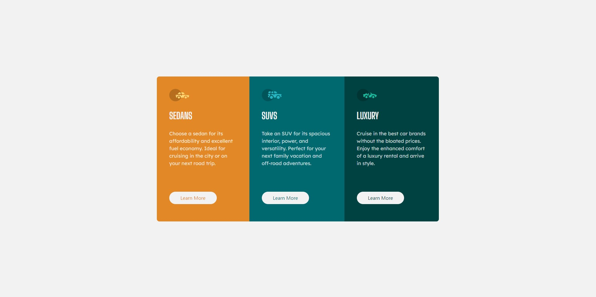

# Frontend Mentor - 3-column preview card component solution

This is a solution to the [3-column preview card component challenge on Frontend Mentor](https://www.frontendmentor.io/challenges/3column-preview-card-component-pH92eAR2-). Frontend Mentor challenges help you improve your coding skills by building realistic projects.

## Table of contents

- [Overview](#overview)
  - [Screenshot](#screenshot)
  - [Links](#links)
- [My process](#my-process)
  - [Built with](#built-with)
- [Author](#author)

## Overview

### Screenshot

### Links

- Solution URL: [GitHub](https://github.com/marquesfelip/3-column-preview-card-component)
- Live Site URL: [3 Column Preview Card Component](https://3-column-preview-card-component-350.pages.dev/)

## My process

### Built with

- Semantic HTML5 markup
- Mobile-first workflow
- [Tailwind](https://tailwindcss.com/) - Tailwindcss

## Author

- GitHub - [marquesfelip](https://github.com/marquesfelip)
- Frontend Mentor - [@marquesfelip](https://www.frontendmentor.io/profile/marquesfelip)
- LinkedIn - [Felipe Marques](https://www.linkedin.com/in/felipemarquessouza/)
